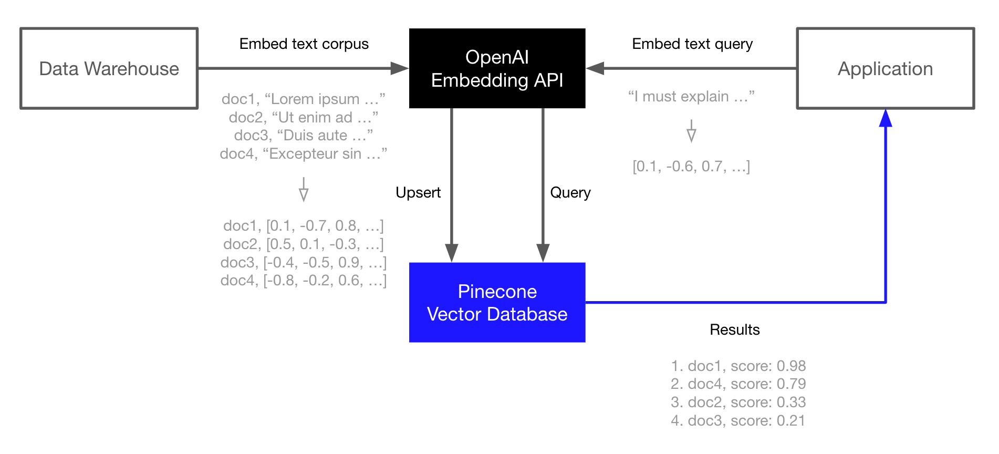

# AI-Semantic-Search-Engine
The aim of this project is to implement a semantic search using artificial intelligence.
To develop a search engine that encodes the user's query into a vector and searches for similarity within a body of text. The user can store all the text to be searched using a vector database like Pinecone. This search engine will be designed to provide accurate and relevant search results.

This is a powerful and common combination for building semantic search, question-answering, threat-detection, and other applications that rely on NLP and search over a large corpus of text data.
The basic workflow looks like this:

#Embed and index
Use the OpenAI Embedding API to generate vector embeddings of your documents (or any text data).
Upload those vector embeddings into Pinecone, which can store and index millions/billions of these vector embeddings, and search through them at ultra-low latencies.

#Search
Pass your query text or document through the OpenAI Embedding API again.
Take the resulting vector embedding and send it as a query to Pinecone.
Get back semantically similar documents, even if they don't share any keywords with the query.

